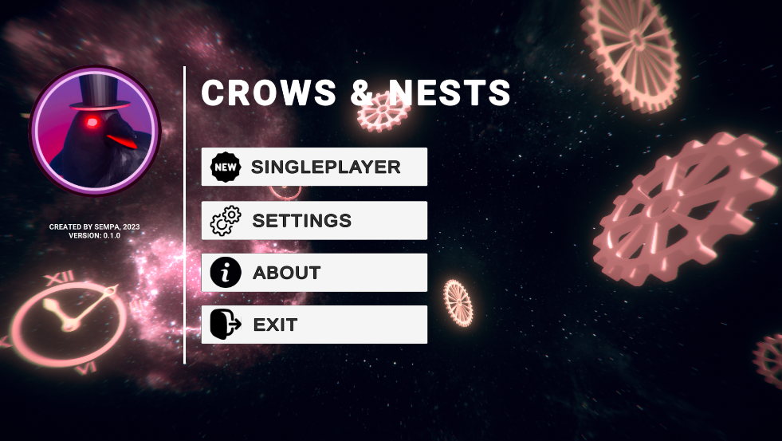
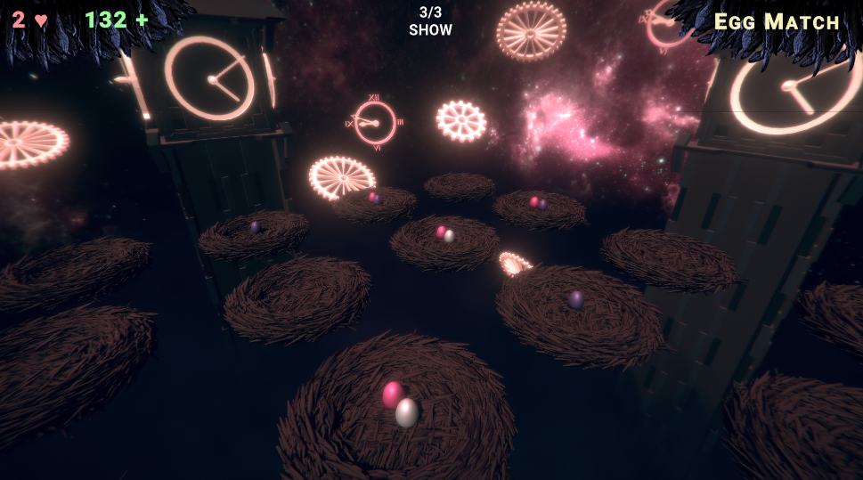

  
  <h1>Crows and Nests</h1>
  

    
    
    
    
  

> Unity version: 2021.3.9f1

Crows And Nests is a game where the player takes on the role of a crow and engages in various mini-games in the arena. Completing these minigames earns the player scores and lives. Falling from the arena subtracts life. The game is currently designed for single-player mode, with plans to introduce multiplayer support in future versions. This is the initial version of the game, which includes three mini-games: "Egg Hunt", a memory game that involves memorizing combinations of eggs in nests and dodging falling objects.

## Preview of current version

## Menu

The game features a basic menu that allows players to start the game and access game settings. In the current version, players can adjust the rendering quality of the scene.

## Spectator mode

If the player dies during a mini-game, they will enter spectator mode until the next mini-game begins. In spectator mode, players can observe the ongoing game without active participation.

## TODO
* Fix timing of egg breaking, not based on time (activated directly in a certain key frame).
* Egg breaking using a delegate.
* Fix player physics.
* Completely rigid body for the player, more plastic movement, point-based falling, lifted [HARD]...
* Simplify nest model.
* Improve tower model, enhance scene appearance, simple particles for nests, optimize lower fog effect.
* Multiplayer menu (find server, host) -> server finder menu, host server menu -> lobby menu.
