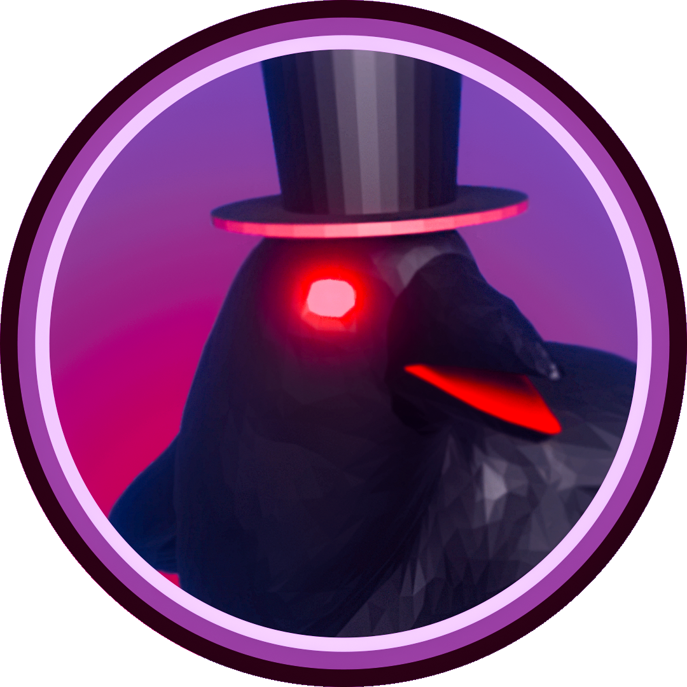

  
  <h1>Crows and Nests</h1>
  

    
    
    
    
  

> Unity version: 2021.3.9f1
> Lowpoly game

## Preview of current version

## Video

## Game structure

## TODO
- [ ] Prostredi
  - [ ] Vymodelovat lepe vypadajici vez z hodinama (aktualni verze: nic moc obarveni, nakvalitni tvary, malo komplexni, nejlepe pouziti textur ruznych materualu pro obarveni)
  - [ ] Dalsi dekorativni material do prostredi, kolem areny je zatim relativne prazdno, bylo by dobre prostor nejaky vhodnym zpusoben zaplnit
  - [ ] Animace pohypu palicek v ptacim hnizde
- [X] Herni postava
  - [X] Pohybove animace
  - [X] Vyladit pohybovou fyziku (opravit big zpetneho odrazu hned pri vyskoku z hnizda)
  - [ ] Vytvorit skiny
- [X] Kamera
  - [X] Limity pohybu v ose Y (kamera se nesmi dostat pod mapu pokud hrac pada dolu)
  - [ ] Treseni kamery pri ruznych efektech
- [ ] Design - ELISKA
  - [X] Vytvorit ikonu hry
  - [ ] Vytvorit baner hry (nejlip primo vyrenderovat s modelu hry v blenderu + postprodukce)
- [ ] Menu - PAVEL
  - [X] 3D scena v pozadi menu
  - [X] Styl tlacitek a textu
  - [ ] Settings menu
  - [X] Main menu
  - [X] Game settings menu
  - [X] Game lobby menu
  - [X] Connect to host menu
- [ ] Zvukove efekty - PAVEL
  - [X] Menu - PAVEL
    - [X] Zvuk stiknuti tlacika - PAVEL
    - [ ] Zvuk spusteni hry - PAVEL
  - [X] Vrana - PAVEL
    - [X] Chuze - PAVEL
    - [X] Vyskok - PAVEL
    - [ ] Dopad - PAVEL
    - [X] Utok - PAVEL
  - [X] Vejce - PAVEL
    - [X] Rozbiti - PAVEL
  - [ ] Hnizdo - PAVEL
    - [ ] Efekt zniceni "pokud hnizdno zmizi z areny / rozbije ho nejaka herni udalost" - PAVEL
  - [ ] Globalni - PAVEL
    - [ ] Zvuk vitezstvi- PAVEL
    - [ ] Zvuk porazky- PAVEL
    - [ ] Zvuk smrti "pokud vrana vypadne z areny"- PAVEL
    - [X] Odpocet "tick hodin"- PAVEL
  - [X] Soundtrack - 
    - [ ] Menu
    - [X] Arena - soundtrack1 
      - ? https://www.youtube.com/watch?v=FNZMAlO_gi4&list=PLlHY6e7WCV6NaJ5iNMoAWSEasT83GOaDo&index=5&ab_channel=GamesMusic
    - [X] Arena - soundtrack2
      - ? https://www.youtube.com/watch?v=OA5oLdbvoLc&ab_channel=IsaacMoring
    - [X] Arena - soundtrack3
- [X] Efekty sceny - ELISKA
  - [X] Pridani mlhy
  - [ ] Particly v prostredi
  - [X] Nocni scena
  - [X] Prizpusobyt osvetleni
  - [X] Skybox (noc/vesmir/...)
- [X] Postprocessing 
  - [X] Vyladeni barev obrazu
- [X] Skript pro rizeni areny
  - [X] Zakladni struktura
  - [X] Vstupy skriptu
  - [X] Hlavni herni smycka
  - [X] Respawn handler
  - [X] Spawn handler
  - [X] Manazer hernich modu
  - [X] Manazer skore
  - [X] Cleaning manager
- [X] Mini Hry
  - [X] Fall guy Perfect match
  - [X] Bitva o vejce
  - [ ] Padajici predmety
  - [ ] ?? napady na dalsi hry

  
### Dodatecne vylepseni: 
* zlepsit vzhled modelu 
* vytvorit vlastni soundtrack (FL Studio)
* vytvorit vlastno font pisma pro hru (Adobe Ilustrator)
* vytvorit trailer video ke hre (Premiera + After Effects)
* publikace na steam 
* moznost hrani na verejnem serveru ()
- [ ] Multiplayer LAN
  - [ ] Lokalni server
  - [ ] Klient
  - [ ] Synchronizace dat
  - [ ] Komponanta pro prenos dat
  - [ ] Automatizovany vyhledavac serveru v lokalni siti
