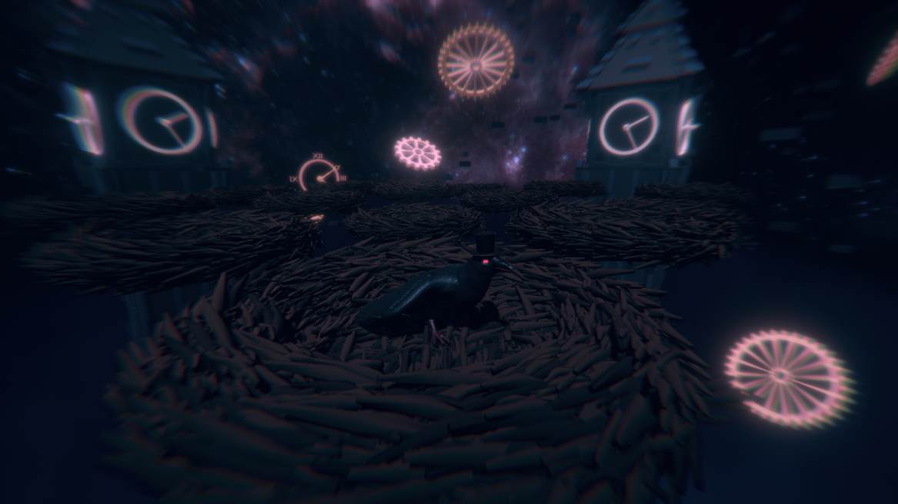
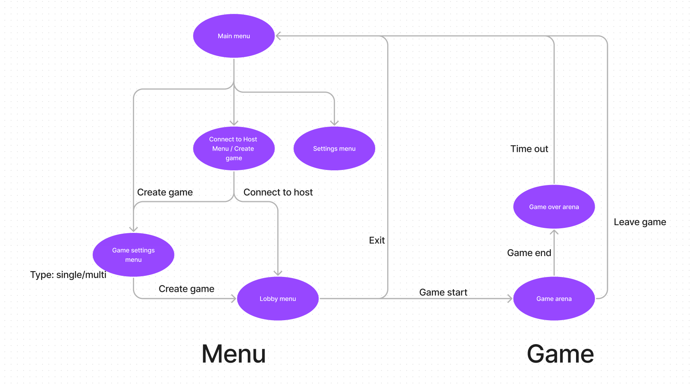

  
  
  
  

> Unity version: 2021.3.9f1

## Preview of current version

## Game structure

## TODO
- [ ] Herni postava
  - [X] Pohybove animace
  - [ ] Vyladit pohybovou fyziku (opravit big zpetneho odrazu hned pri vyskoku z hnizda)
  - [ ] Vytvorit skiny
- [ ] Kamera
  - [ ] Limity pohybu v ose Y (kamera se nesmi dostat pod mapu pokud hrac pada dolu)
  - [ ] Treseni kamery pri ruznych efektech
- [ ] Design
  - [ ] Vytvorit ikonu hry
  - [ ] Vytvorit baner hry (nejlip primo vyrenderovat s modelu hry v blenderu + postprodukce)
- [ ] Menu
  - [ ] 3D scena v pozadi menu
  - [ ] Styl tlacitek a textu
  - [ ] Settings menu
  - [X] Main menu
  - [ ] Game settings menu
  - [ ] Game lobby menu
  - [ ] Connect to host menu
- [ ] Zvukove efekty
  - [ ] Menu
    - [ ] Zvuk stiknuti tlacika
    - [ ] Zvuk pripojeni do lobby hry
    - [ ] Zvuk spusteni hry
  - [ ] Vrana
    - [ ] Chuze
    - [ ] Vyskok
    - [ ] Dopad
    - [ ] Utok
  - [ ] Vejce
    - [ ] Rozbiti
  - [ ] Hnizdo
    - [ ] Efekt zniceni "pokud hnizdno zmizi z areny / rozbije ho nejaka herni udalost"
  - [ ] Globalni
    - [ ] Zvuk vitezstvi
    - [ ] Zvuk porazky
    - [ ] Zvuk smrti "pokud vrana vypadne z areny"
    - [ ] Odpocet "tick hodin"
  - [ ] Soundtrack
    - [ ] Menu
    - [X] Arena - soundtrack1 
      - ? https://www.youtube.com/watch?v=FNZMAlO_gi4&list=PLlHY6e7WCV6NaJ5iNMoAWSEasT83GOaDo&index=5&ab_channel=GamesMusic
    - [ ] Arena - soundtrack2
      - ? https://www.youtube.com/watch?v=OA5oLdbvoLc&ab_channel=IsaacMoring
    - [ ] Arena - soundtrack3
- [ ] Efekty sceny
  - [X] Pridani mlhy
  - [ ] Particly v prostredi
  - [X] Nocni scena
  - [ ] Prizpusobyt osvetleni
  - [X] Skybox (noc/vesmir/...)
- [X] Postprocessing
  - [X] Vyladeni barev obrazu
- [ ] Skript pro rizeni areny
  - [X] Zakladni struktura
  - [X] Vstupy skriptu
  - [ ] Hlavni herni smycka
  - [X] Respawn handler
  - [X] Spawn handler
  - [ ] Manazer hernich modu
  - [ ] Manazer skore
  - [X] Cleaning manager
- [ ] Mini Hry
  - [ ] Fall guy Perfect match
  - [ ] Bitva o vejce
  - [ ] Padajici predmety
  - [ ] ?? napady na dalsi hry
- [ ] Multiplayer LAN
  - [ ] Lokalni server
  - [ ] Klient
  - [ ] Synchronizace dat
  - [ ] Komponanta pro prenos dat
  - [ ] Automatizovany vyhledavac serveru v lokalni siti
  
### Dodatecne vylepseni: 
* zlepsit vzhled modelu
* vytvorit vlastni soundtrack
* vytvorit vlastno font pisma pro hru
* vytvorit trailer video ke hre
* publikace na steam
* moznost hrani na verejnem serveru
